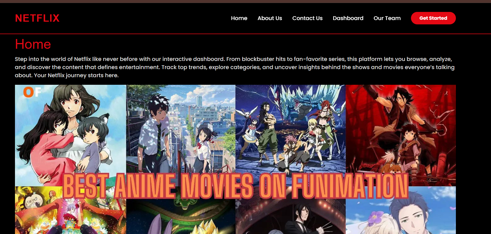
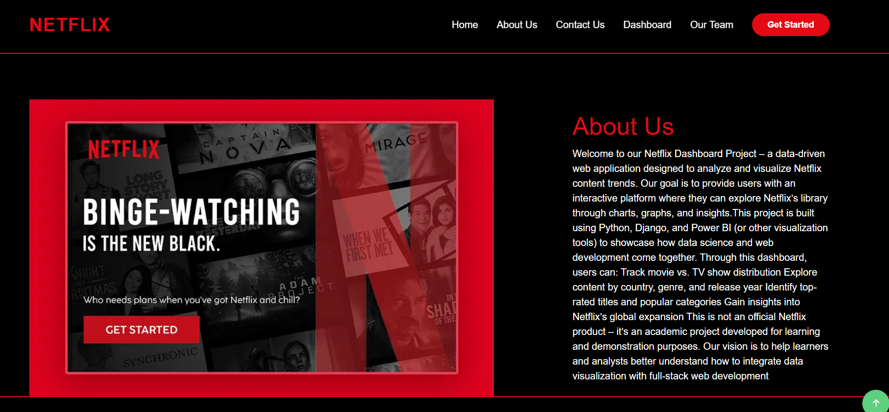
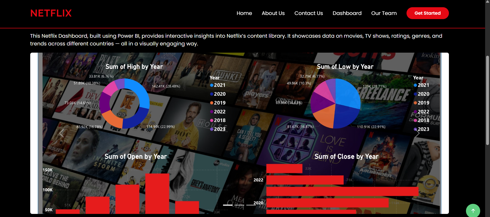
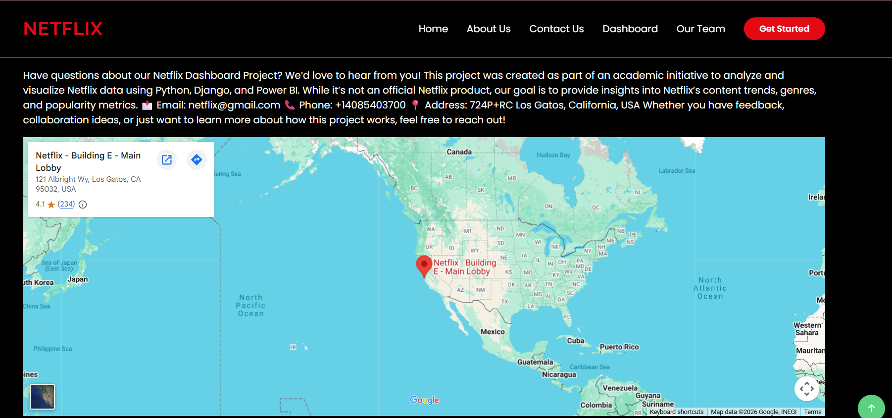

Netflix Dashboard Showcase Website using Django

Overview
This project is a Django-based web application developed to showcase a Netflix Power BI Dashboard. It provides a simple and user-friendly interface to present the dashboard and project information.

Features
- Netflix Dashboard Showcase
- Responsive User Interface
- Home, About, Dashboard and Contact pages
- Django Template Rendering
- Static Assets Integration
 
Technologies Used
- Python
- Django
- HTML
- CSS
- SQLite

How to Run
1. Open the project folder.
2. Run the following command:

```bash
python manage.py runserver
```

Open your browser and visit:

```
http://127.0.0.1:8000/
```

Project Preview
### 🏠 Home Page


### ℹ️ About Us


### 📊 Dashboard


### 📞 Contact Us


Author

**Solanki Sinha**
